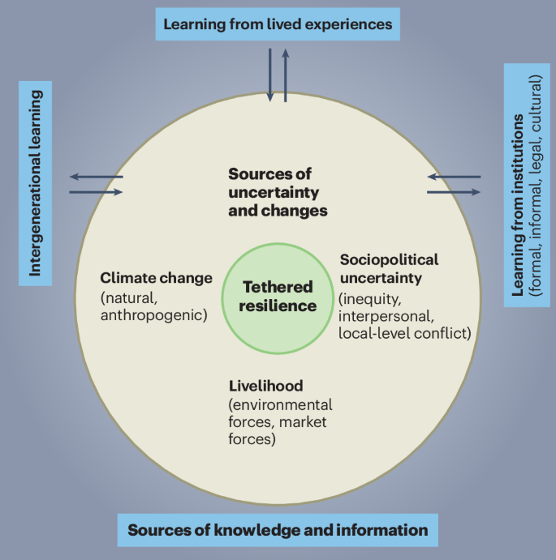

I have a new paper _Nature Climate Change_, 
"[Future-making beyond (Im)mobility through tethered reilience](/publications/mallick_2025_tethered_resilience/)," 
led by [Bishawjit Mallick](https://www.uu.nl/staff/BMallick), 
that introduces a concept of _tethered resilience_, related to people's
attachment to their native communities and place, and argues that this
concept provides new and useful ways to think about connections among 
climate change, migration, and adaptation.

<!--more-->

Much of the literature on climate change and migration assumes
stark dichotomies between migrating and not migrating, and
between voluntary and involuntary decisions about migration
(e.g., wanting to stay or leave but not being able to do so).
This dichotomous framing emphasizes external pressures, thus
characterizing decisions to leave or stay as purely reactive.
We argue that such decisions are better understood in the context
of _future-making:_ people's broader thoughts and aspirations
for achieving secure and fulfilling lives.

_Tethered resilience_ accounts for the connections people experience
with their communities and places of origin. These connections can
enhance the resilience of individuals and communities as some people
stay and others leave, either premanently or temporarily, and 
they also expand the range of possibilities people consider for their
futures.

A lot of the literature on migration focuses on tangible, often
financial aspects, such as seasonal migration for employment
or migrants sending remittances back to their home communities.
In this paper, we emphasize a different aspect: the production and
transfer of knowledge through experiences of migration and adaptation
to environmental change.

New sources of knowledge interact with experiences of change and uncertainty
to create tethered resilience as households and communities imagine and then
enact pathways to better lives.
